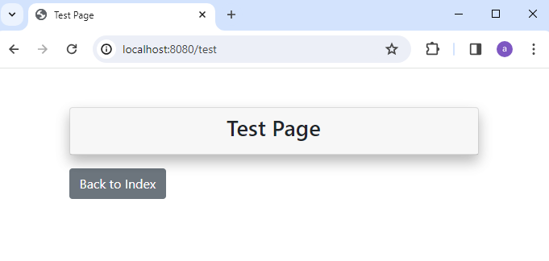
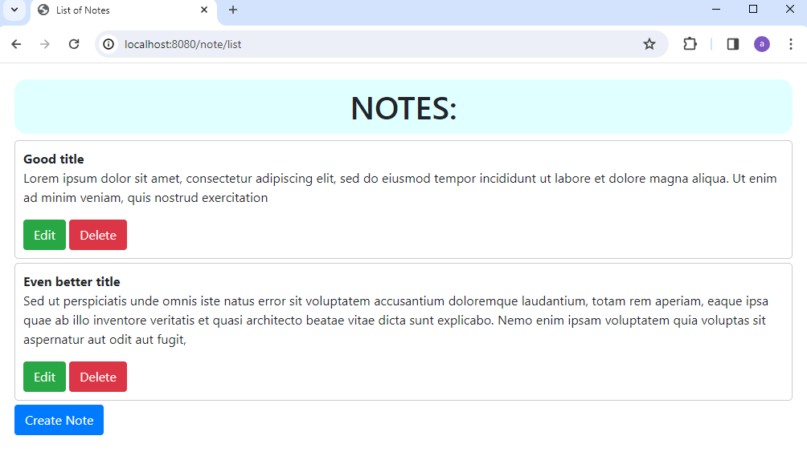
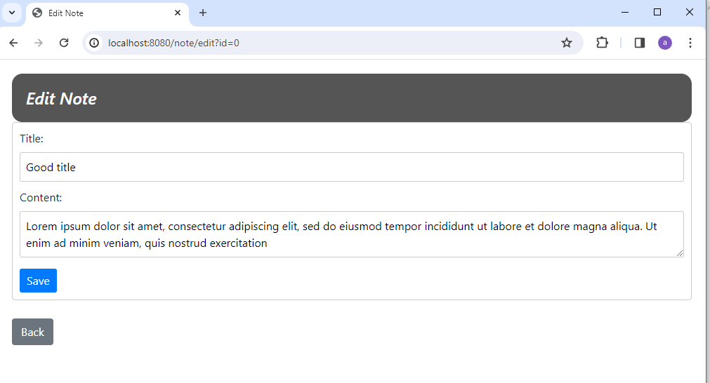

### Module 13 homework "Spring Boot - MVC"

This is homework for Module 13 of JavaDeveloper (14) GoIt course

`Spring` framework second encounter. We have to achieve new goals:
1. Add Spring MVC module. And just to make sure all is working as it suppose - create `TestController`. 
2. Add `Thymeleaf` library and create template for out TestController,  [http://localhost:8080/test](http://localhost:8080/test)
3. Create `NoteController`. Create pure HTML UI to manage out notes.
   
    

Must have:
- `GET /note/list` - to get all notes (title and content). Every note can be <b>deleted<b> or <b>edited<b>
- `POST /note/delete` - delete note by ID. Redirecting to `/note/list` when note delete is complete.
- `GET /note/edit?id=xxx` - button `Edit` opens `Edit` page.
- `POST /note/edit` - here edit note request is sent.

    

    

And as an * task - `bootstrap` library have been added to make everything look better.

Also, I`ve add starting page [http://localhost:8080](http://localhost:8080).

